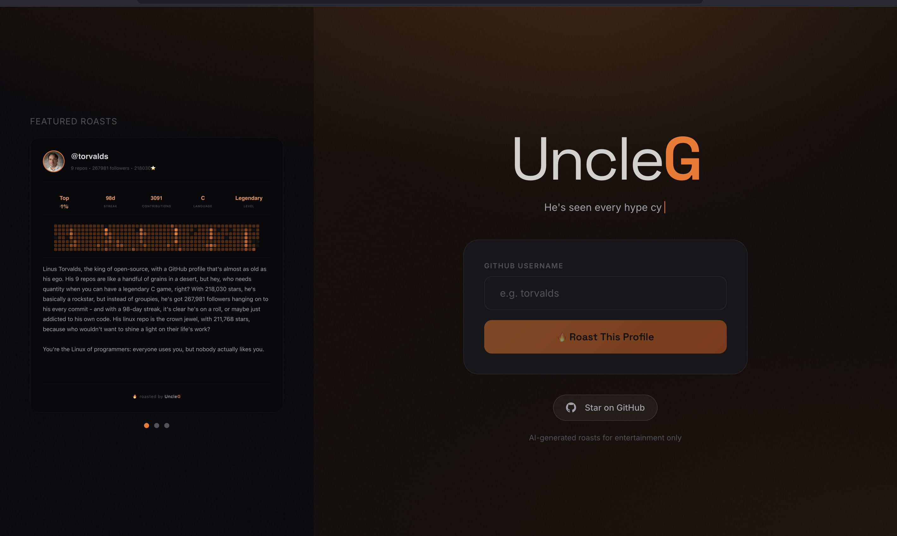

# UncleG 

**Your code's harshest critic.** Get roasted based on your GitHub profile.



## What is this?

UncleG analyzes your GitHub profile and generates a sarcastic, witty roast based on your repos, contributions, languages, and coding habits.

## Tech Stack

- **Frontend:** React + Vite
- **Backend:** Express.js
- **LLM:** Groq API (Llama 3.3 70B)
- **Data:** GitHub GraphQL + REST API

## Quick Start

```bash
# Clone
git clone https://github.com/priya-singh27/uncleG.git
cd uncleG

# Install dependencies
cd client && npm install
cd ../server && npm install

# Set up environment variables
cp server/.env.example server/.env
# Add your GROQ_API_KEY and GITHUB_TOKEN

# Run
cd client && npm run dev    # Terminal 1
cd server && npm run dev    # Terminal 2
```

## Environment Variables

| Variable | Description |
|----------|-------------|
| `GROQ_API_KEY` | Get from [console.groq.com](https://console.groq.com) |
| `GITHUB_TOKEN` | Personal Access Token with `read:user` scope |

## Rate Limiting

- 10 roasts per IP per day

## License

MIT

